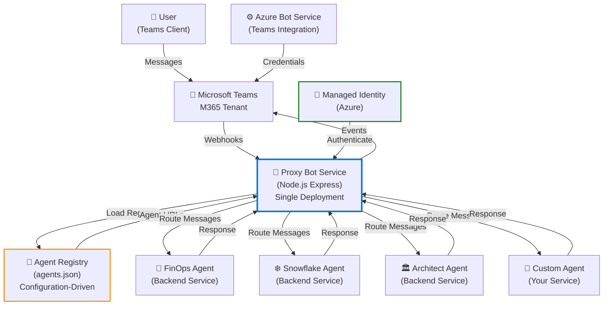
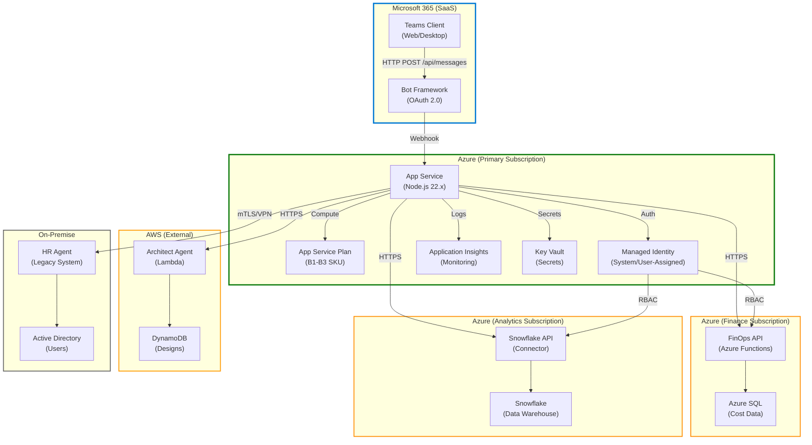

# 🤖 Microsoft 365 Agents Proxy - Multi-Agent Host

> **Seamlessly onboard and manage agents from any cloud provider or server into Microsoft Teams**

This project provides a scalable, configuration-driven proxy solution that enables organizations to host multiple backend agents (FinOps, Analytics, HR, Architecture, etc.) within a single Microsoft Teams bot deployment. Instead of creating separate Azure resources for each agent, this unified proxy dynamically routes user conversations to the appropriate agent backend through an extensible registry pattern. Built on the [Microsoft 365 Agents SDK](https://github.com/Microsoft/Agents), it supports Adaptive Cards, custom event handling, and intelligent agent selection—allowing companies to onboard new agents without re-deploying infrastructure, just by updating configuration files.

---

## 📋 Prerequisites

### 🖥️ **Local Environment**

No Microsoft 365 tenant is required for local development and testing!

- **[Node.js](https://nodejs.org/)** v18 or higher
- **[Visual Studio Code](https://code.visualstudio.com/)** (recommended)
- **[Microsoft 365 Agents Toolkit Extension](https://aka.ms/teams-toolkit)** for VS Code
  - Install from VS Code Extensions marketplace
  - Provides debugging, testing, and Teams integration
- **npm** or **yarn** (comes with Node.js)

### ☁️ **Azure Environment** (for Production Deployment)

- **Azure Subscription** with appropriate permissions
- **Azure CLI** ([Installation Guide](https://learn.microsoft.com/cli/azure/install-azure-cli))
- **[Azure Bot Service](https://learn.microsoft.com/azure/bot-service/)** configured
- **Azure App Service** or **Azure Container Apps** to host the proxy
- **User-Assigned Managed Identity** for secure agent communication
- **Contributor** or **Owner** role in your subscription for creating resources

---

## 🚀 Quick Start

### **Step 1: Clone and Install**

```bash
git clone <repository-url>
cd M365_SDK_Proxy_Agent
npm install
```

### **Step 2: Start Backend Agents** (Terminal 1)

Start all mock agents (FinOps, Snowflake, etc.):

```bash
npm run start:all-agents
```

You should see output like:
```
FinOps Agent listening on http://127.0.0.1:8001
Snowflake Agent listening on http://127.0.0.1:8002
...
```

### **Step 3: Launch in VS Code Debugger** (Terminal 2)

1. Open this repository in **VS Code**
2. Click the **Microsoft 365 Agents Toolkit** icon in the left sidebar
3. Press **F5** and select **`Debug in Microsoft 365 Agents Playground`** (or the "Default F5" option)
4. Wait for the terminal to display: `Microsoft 365 Agents Playground is being launched: http://localhost:56150`
5. Open your browser to **`http://localhost:56150`**

### **Step 4: Test in the Playground** 🎮

Inside the Teams Agents Playground:

- Type **`list`** → See Adaptive Card with available agents
- Type **`1`** or **`2`** → Select an agent by number
- Send any message → Routes to the selected agent
- Type **`list`** again → Switch to a different agent

---

## 💬 Available Chat Commands

Once you've selected an agent, here are the common commands you can use:

| Command | Agent | Description | Example |
|---------|-------|-------------|---------|
| **`list`** | All | Display available agents and switch between them | `list` |
| **`help`** | All | Show agent-specific commands and capabilities | `help` |
| **`show resources`** | FinOps Agent | List all Azure resources with costs | `show resources` |
| **`cost <resource>`** | FinOps Agent | Analyze cost for a specific resource | `cost vm-prod-001` |
| **`optimize`** | FinOps Agent | Get cost optimization recommendations | `optimize` |
| **`show databases`** | Snowflake Agent | List available data warehouses and tables | `show databases` |
| **`select * from`** | Snowflake Agent | Execute SQL query | `select * from costs limit 10` |
| **`query analyze`** | Snowflake Agent | Analyze query execution performance | `query analyze` |
| **`health check`** | Architect Agent | Check system health and architecture status | `health check` |
| **`design review`** | Architect Agent | Request architectural design review | `design review` |
| **`employee info <id>`** | HR Agent | Retrieve employee information | `employee info E12345` |
| **`onboarding`** | HR Agent | Start employee onboarding process | `onboarding` |

### **Custom Commands**

You can add your own commands by:

1. **Extending agent endpoints** – Agents listen for keywords and respond accordingly
2. **Adding event handlers** – Register custom event handlers in `src/agent.js`
3. **Updating agents.json** – Define command metadata for each agent

Example agent response structure:

```json
{
  "type": "message",
  "text": "Here are your top 3 expensive resources:",
  "attachments": [
    {
      "contentType": "application/vnd.microsoft.card.adaptive",
      "content": {
        "type": "AdaptiveCard",
        "version": "1.4",
        "body": [
          {
            "type": "FactSet",
            "facts": [
              { "name": "Resource", "value": "vm-prod-001" },
              { "name": "Monthly Cost", "value": "$1,250.50" },
              { "name": "Status", "value": "Optimizable" }
            ]
          }
        ]
      }
    }
  ]
}
```

---

## 🏗️ Architecture

### **High-Level Overview**



### **Component Details**

| Component | Purpose | Technology |
|-----------|---------|-----------|
| **Proxy Bot Service** | Central routing hub; processes Teams messages and distributes to agents | Node.js + Express + [@microsoft/agents-hosting](https://learn.microsoft.com/azure/bot-service/agents) |
| **Agent Registry** | Configuration file (`agents.json`) listing all available agents and their endpoints | JSON Configuration |
| **Agent Backend** | External APIs/services (can be in AWS, GCP, on-premise, or Azure) | Any HTTP-capable service |
| **Teams M365 Tenant** | End-user interface for messaging and agent interaction | Microsoft Teams |
| **Azure Bot Service** | OAuth 2.0 authentication, JWT validation, Teams protocol handling | Azure |
| **Managed Identity** | Secure, credential-less authentication for Azure resources | Azure Active Directory |
| **Adaptive Cards** | Rich UI rendering in Teams (forms, buttons, tables, images, etc.) | Adaptive Card JSON |

### **Message Flow**

1. **User types message** in Teams
2. **Teams sends webhook** to Proxy Bot endpoint (`/api/messages`)
3. **Proxy validates JWT** using Bot Framework credentials
4. **Proxy checks conversation state** to determine selected agent
5. **Proxy routes message** to agent's HTTP endpoint
6. **Agent processes** and responds
7. **Proxy converts response** (Adaptive Cards / AG-UI) and sends back to Teams
8. **User sees response** in Teams chat

---

## ✨ Key Features

### 🎯 **Agent-Agnostic Routing**

Add agents without re-deploying the proxy. Just update `agents.json` and restart:

```json
[
  {
    "id": "finops",
    "name": "FinOps Agent",
    "url": "http://127.0.0.1:8001",
    "description": "Financial operations and cost optimization",
    "cardFormat": "agui-v1"
  },
  {
    "id": "snowflake",
    "name": "Snowflake Agent",
    "url": "http://127.0.0.1:8002",
    "description": "Data warehouse and analytics queries",
    "cardFormat": "agui-v1"
  }
]
```

### 🎨 **Adaptive Cards & AG-UI Conversion**

The proxy automatically converts **AG-UI** (Agent UI) responses into **Adaptive Cards** for Teams rendering.

**What is AG-UI?**
- Standardized, agent-agnostic UI format used by Microsoft 365 Agents
- Independent of Teams, Slack, Discord, etc.

**What are Adaptive Cards?**
- Microsoft's rich, JSON-based UI format for Teams
- Support buttons, forms, tables, images, and more

**How does the conversion work?**

When an agent returns AG-UI (e.g., a choice-list):

```json
{
  "kind": "choice-list",
  "title": "Select a resource",
  "description": "Pick a resource to analyze",
  "choices": [
    { "id": "vm-001", "label": "Web Server", "description": "Production web VM" },
    { "id": "vm-002", "label": "Database", "description": "Primary DB server" }
  ]
}
```

The proxy converts it to an Adaptive Card and renders it in Teams with rich UI elements like choice lists, buttons, and forms.

**Design your own Adaptive Cards:**
Use the [Adaptive Card Designer](https://adaptivecards.microsoft.com/designer) to prototype and test card designs before integrating them.

### ⚡ **Event-Driven Architecture**

Agents emit events that the proxy can handle and respond to. Examples:

```javascript
// Event: FinOps agent selects a resource
registerEventHandler("agent:finops:selectResource", async (context, { agentId, data }) => {
  const resourceId = data.resourceId;
  console.log(`Resource selected: ${resourceId}`);
  
  // Update conversation state, trigger downstream actions, etc.
  await context.sendActivity(`✅ ${data.resourceName} selected. Analyzing...`);
});

// Event: Snowflake agent executes a query
registerEventHandler("agent:snowflake:queryResult", async (context, { agentId, data }) => {
  console.log(`Query returned ${data.rowCount} rows`);
  await context.sendActivity(`📊 Query executed: **${data.rowCount}** rows`);
});

// Wildcard handler: any agent can emit "analyze" event
registerEventHandler("*:analyze", async (context, { agentId, data }) => {
  await context.sendActivity(`🔎 Analysis started for ${agentId}...`);
});
```

See the [**Event Handling Guide**](#-event-handling-and-custom-actions) for more details.

---

## 📚 How to Guides

### ➕ **Adding a New Agent**

#### **Scenario:** You have a custom HR agent running at `http://my-hr-service.com`

**Step 1:** Edit `agents.json`

```json
[
  // ... existing agents ...
  {
    "id": "hr",
    "name": "HR Agent",
    "url": "http://my-hr-service.com",
    "description": "Handle employee onboarding, benefits, and HR queries",
    "cardFormat": "agui-v1"
  }
]
```

**Step 2:** Restart the proxy

```bash
# Press Ctrl+C to stop the current debug session
# Then press F5 again to restart
```

**Step 3:** Test

In the Teams Playground, type `list` to see your new HR agent in the selection card.

---

### 🎨 **Managing Adaptive Cards**

#### **Scenario:** Your agent needs to return a rich form with buttons, dropdowns, and images

**Step 1:** Design the card using [Adaptive Card Designer](https://adaptivecards.microsoft.com/designer)

**Step 2:** Your agent endpoint returns AG-UI or Adaptive Card JSON

**Option A – Return Plain Text:**
```json
{
  "type": "message",
  "text": "Hello! I can help with FinOps analysis."
}
```

**Option B – Return AG-UI (Recommended):**
```json
{
  "kind": "choice-list",
  "title": "Which analysis?",
  "choices": [
    { "id": "cost", "label": "Cost Optimization" },
    { "id": "budget", "label": "Budget Planning" }
  ]
}
```

**Option C – Return Adaptive Card Directly:**
```json
{
  "$schema": "http://adaptivecards.io/schemas/adaptive-card.json",
  "type": "AdaptiveCard",
  "version": "1.4",
  "body": [
    {
      "type": "TextBlock",
      "text": "Resource Analysis Results",
      "weight": "bolder"
    }
  ],
  "actions": [
    {
      "type": "Action.OpenUrl",
      "title": "View in Azure Portal",
      "url": "https://portal.azure.com"
    }
  ]
}
```

The proxy will render these properly in Teams.

---

### ⚡ **Event Handling and Custom Actions**

#### **Scenario:** When FinOps agent selects a resource, you want to:
1. Log the selection
2. Update conversation state
3. Trigger analysis in Snowflake agent

**Step 1:** Register an event handler in `src/agent.js`

```javascript
registerEventHandler("agent:finops:selectResource", async (context, { agentId, data }) => {
  const { resourceId, resourceName } = data;
  
  // 1. Log selection
  console.log(`[FinOps] Selected: ${resourceName} (${resourceId})`);
  
  // 2. Update conversation state
  const conversationId = context.activity.conversation.id;
  const state = await readConversationState(conversationId);
  state.selectedResource = { id: resourceId, name: resourceName };
  await writeConversationState(conversationId, state);
  
  // 3. Reply to user
  await context.sendActivity(`✅ **${resourceName}** selected. Analyzing...`);
  
  // 4. Optional: Trigger downstream agent
  // e.g., call Snowflake agent with the selected resource
});
```

**Step 2:** Agent emits the event by sending:

```json
{
  "type": "event",
  "name": "agent:finops:selectResource",
  "value": {
    "resourceId": "vm-001",
    "resourceName": "Web Server"
  }
}
```

**Step 3:** Proxy intercepts, executes handler, and responds to user

See [eventMapper.js](src/eventMapper.js) for more examples.

---

### 🚀 **Deploying to Azure**

#### **Prerequisites for Azure Deployment**

✅ Azure Subscription and CLI configured
✅ Resource Group created
✅ Tenant Admin has approved bot registration

#### **Step 1: Create Azure Resources**

Using **Azure CLI**:

```bash
# Set variables
RESOURCE_GROUP="my-agents-rg"
LOCATION="eastus"
BOT_NAME="my-agents-proxy"
BOT_DISPLAY_NAME="My Multi-Agent Proxy"

# Create resource group
az group create --name $RESOURCE_GROUP --location $LOCATION

# Deploy Bicep template
az deployment group create \
  --resource-group $RESOURCE_GROUP \
  --template-file infra/azure.bicep \
  --parameters \
    resourceBaseName=$BOT_NAME \
    botDisplayName="$BOT_DISPLAY_NAME" \
    webAppSKU="B1"
```

**What gets created:**
- 🏢 **App Service Plan** (B1 tier for dev, B2 for production)
- 💻 **App Service** (hosts your Node.js proxy)
- 🔐 **Managed Identity** (secure credential-less authentication)
- 🤖 **Bot Framework Registration** (Teams integration)
- 📦 **Application Insights** (monitoring and diagnostics)

#### **Step 2: Configure Environment Variables**

```bash
az webapp config appsettings set \
  --resource-group $RESOURCE_GROUP \
  --name $BOT_NAME \
  --settings \
    "AGENT_REGISTRY_URL=https://my-registry.azurewebsites.net/agents" \
    "NODE_ENV=production"
```

#### **Step 3: Deploy Code**

```bash
# Via Azure CLI
az webapp deployment source config-zip \
  --resource-group $RESOURCE_GROUP \
  --name $BOT_NAME \
  --src app.zip

# Or via GitHub Actions (recommended for CI/CD)
```

#### **Step 4: Configure Bot Service**

```bash
az bot create \
  --app-type MultiTenant \
  --kind registration \
  --name $BOT_NAME \
  --resource-group $RESOURCE_GROUP \
  --appid <YOUR_MANAGED_IDENTITY_CLIENT_ID>
```

#### **Official Microsoft Documentation**

- 📖 [Azure Bot Service Documentation](https://learn.microsoft.com/azure/bot-service/)
- 📖 [Azure App Service Deployment](https://learn.microsoft.com/azure/app-service/deploy-best-practices)
- 📖 [Managed Identity for Azure resources](https://learn.microsoft.com/entra/identity/managed-identities-azure-resources/)
- 📖 [Adaptive Cards Documentation](https://learn.microsoft.com/adaptive-cards/)
- 📖 [Microsoft Teams App Development](https://learn.microsoft.com/microsoftteams/platform/)

---

## 🔒 Security & Best Practices

### **Managed Identity (Zero Secrets)** ✅

The proxy uses **Azure Managed Identity** instead of connection strings or API keys:

```bicep
resource identity 'Microsoft.ManagedIdentity/userAssignedIdentities@2023-01-31' = {
  location: location
  name: identityName
}
```

**Benefits:**
- No secrets in environment variables
- Automatic token refresh
- RBAC-based access control
- Audit trails in Azure

### **RBAC (Role-Based Access Control)** 🔑

Define which agents can access which resources:

```bash
# Assign "Contributor" role to proxy's managed identity for reading Azure resources
az role assignment create \
  --assignee-object-id <MANAGED_IDENTITY_PRINCIPAL_ID> \
  --role "Contributor" \
  --scope /subscriptions/<SUBSCRIPTION_ID>/resourceGroups/$RESOURCE_GROUP
```

### **Multi-Agent Organization Patterns**

#### **Pattern 1: Department-Based Bots**

```
Central Teams Tenant
  ├── HR Bot (HR Agent)
  ├── Finance Bot (FinOps Agent)
  └── Tech Bot (Architect + Snowflake Agents)
     └── Managed by IT Team, RBAC: IT Managers
```

**Advantages:**
- Clear ownership per department
- Independent scaling
- Department-specific security policies

#### **Pattern 2: Centralized Multi-Tenant Proxy** 

```
Single Proxy Bot
  ├── Agent Registry (Central)
  ├── FinOps Agent → Finance Azure subscription
  ├── Snowflake Agent → Analytics Azure subscription
  ├── Architect Agent → IT Azure subscription
  └── HR Agent → HR Azure subscription (on-premise)
```

**Advantages:**
- Single deployment point
- Agents in different subscriptions/clouds
- Central audit and monitoring
- Easier to manage agent lifecycle

#### **Pattern 3: Hub-and-Spoke with Regional Proxies**

```
Hub Proxy (Central, EMEA region)
  ├── Regional Proxy 1 (Americas)
  ├── Regional Proxy 2 (APAC)
  └── Shared Registry
```

**Advantages:**
- Low-latency routing per region
- Disaster recovery
- Compliance (data residency)

### **Agent Communication Security**

**Scenario:** Your FinOps agent is in AWS, Snowflake in Azure, HR on-premise

```
Proxy (Azure) ← TLS/HTTPS → FinOps Agent (AWS)
            ← Managed Identity → Snowflake Agent (Azure)
            ← mTLS (cert-based) → HR Agent (On-Prem)
```

**Ensure:**
- ✅ All agent endpoints use **HTTPS** (TLS 1.2+)
- ✅ Agents validate **bot's identity** (JWT)
- ✅ Proxy validates **agent responses** (certificate pinning for critical agents)
- ✅ Use **VPN/ExpressRoute** for on-premise agents
- ✅ Log all agent calls to **Application Insights**

---

## 📊 Azure Deployment Diagram



---

## 🧪 Testing & Validation

### **Local Testing Checklist**

```bash
# 1. Verify Node.js version
node --version  # Should be v18+

# 2. Install dependencies
npm install

# 3. Start agents
npm run start:all-agents

# 4. In VS Code: Press F5 and select "Debug in Microsoft 365 Agents Playground"

# 5. In the Playground:
#    - Type 'list' → Should see Adaptive Card with agents
#    - Type '1' → Should route to FinOps agent
#    - Type 'cost optimization' → Should get response from FinOps
#    - Type 'list' again → Should switch agents
#    - Type '2' → Should route to Snowflake agent
#    - Type 'select * from ...' → Should get query response

# 6. Check logs for errors
#    - Look for "[Event Mapper]" entries
#    - Check agent response times
#    - Monitor memory usage
```

### **Azure Deployment Validation**

```bash
# 1. Check App Service is running
az webapp list --resource-group $RESOURCE_GROUP --query '[].name'

# 2. View application logs
az webapp log tail --resource-group $RESOURCE_GROUP --name $BOT_NAME

# 3. Test agent endpoint
curl -X POST https://$BOT_NAME.azurewebsites.net/api/messages \
  -H "Authorization: Bearer $(az account get-access-token --query accessToken -o tsv)" \
  -H "Content-Type: application/json" \
  -d '{"type":"message","text":"hello"}'

# 4. Monitor with Application Insights
az monitor metrics list \
  --resource /subscriptions/$SUBSCRIPTION_ID/resourceGroups/$RESOURCE_GROUP/providers/Microsoft.Web/sites/$BOT_NAME \
  --metric "RequestCount" \
  --start-time $(date -u -d '1 hour ago' +%Y-%m-%dT%H:%M:%S) \
  --end-time $(date -u +%Y-%m-%dT%H:%M:%S) \
  --interval PT5M
```

---

## 📖 Example Workflows

### **Workflow 1: FinOps Cost Analysis**

```
User: "Show me the most expensive resources"
     ↓
Proxy: Route to FinOps Agent
     ↓
FinOps Agent: Return choice-list of resources
     ↓
Proxy: Convert to Adaptive Card
     ↓
User: Select "VM-prod-001"
     ↓
Proxy: Emit "agent:finops:selectResource" event
     ↓
Event Handler: Update conversation state
     ↓
Proxy: Ask Snowflake for cost trends
     ↓
Snowflake Agent: Return historical cost data
     ↓
Proxy: Format and display to user
```

### **Workflow 2: Cross-Agent Intelligence**

```
User: "Analyze my data warehouse performance and suggest cost optimizations"
   ↓
Proxy: Route to Snowflake Agent
   ↓
Snowflake Agent: Analyze query execution, return performance metrics
   ↓
Proxy: Emit "agent:snowflake:queryResult" event
   ↓
Proxy: Route to FinOps Agent (automatically)
   ↓
FinOps Agent: Analyze cost impact of performance issue
   ↓
Proxy: Combine responses and send to user
   ↓
User: See both performance AND cost insights
```

---

## 🆘 Troubleshooting

### **"Backend unavailable" Error**

```
Error: ECONNREFUSED 127.0.0.1:8001
```

**Solution:**
```bash
# Make sure all agents are running
npm run start:all-agents

# Check that agents are listening
curl http://127.0.0.1:8001/health  # FinOps
curl http://127.0.0.1:8002/health  # Snowflake
```

### **"No agent selected" in Teams**

**Solution:** Type `list` to see available agents, then select one by number

### **Adaptive Card not rendering**

**Solution:**
- Validate card JSON at [adaptivecards.microsoft.com/designer](https://adaptivecards.microsoft.com/designer)
- Check `cardFormat` property in `agents.json`
- See [Adaptive Card version compatibility](https://learn.microsoft.com/en-us/adaptive-cards/authoring-cards/card-schema)

### **Azure deployment fails**

```bash
# Check Bicep syntax
az bicep validate --file infra/azure.bicep

# View deployment errors
az deployment group show \
  --resource-group $RESOURCE_GROUP \
  --name <DEPLOYMENT_ID> \
  --query properties.error
```

---

## 📚 Learn More

- 🎓 [Microsoft 365 Agents SDK](https://github.com/Microsoft/Agents)
- 🎓 [Adaptive Cards Documentation](https://adaptivecards.io/)
- 🎓 [Azure Bot Service](https://learn.microsoft.com/en-us/azure/bot-service/)
- 🎓 [Azure Managed Identity](https://learn.microsoft.com/en-us/entra/identity/managed-identities-azure-resources/)
- 🎓 [Teams App Development](https://learn.microsoft.com/en-us/microsoftteams/platform/overview)
- 🎓 [Microsoft 365 Agents SDK](https://github.com/Microsoft/Agents) (Core Platform)

---

## 🤝 Contributing

Found a bug? Want to add a feature? 

1. Fork this repository
2. Create a feature branch (`git checkout -b feature/amazing-feature`)
3. Commit your changes (`git commit -m 'Add amazing feature'`)
4. Push to the branch (`git push origin feature/amazing-feature`)
5. Open a Pull Request

---

## 📄 License

This project is licensed under the **MIT License** – see the LICENSE file for details.

---

## ❓ FAQ

**Q: Can agents be in different cloud providers?**
A: Yes! Agents can be in AWS, GCP, Azure, on-premise, or any HTTP-accessible service. The proxy routes via HTTPS.

**Q: Do I need a Microsoft 365 tenant for local development?**
A: No! Use the Microsoft 365 Agents Playground for local testing without a tenant.

**Q: Can I add agents without restarting?**
A: Currently, restart required. We're working on hot-reload support.

**Q: What's the max number of agents this proxy can route to?**
A: Tested with 100+ agents. Scaling depends on your App Service SKU.

**Q: How do I monitor agent performance?**
A: Use Application Insights (automatically enabled in Azure) and check agent response times in logs.

---

**Made with ❤️ by [Emilio Alvarez] and [Albert Tanure](https://www.linkedin.com/in/albert-tanure) for modern enterprises. Ready to scale your agent ecosystem!** 🚀
node -e "require('http').createServer((req,res)=>{if(req.method==='GET'&&req.url==='/agents'){res.statusCode=200;res.setHeader('content-type','application/json');res.end(JSON.stringify([{id:'legal',name:'Legal Agent',url:'http://127.0.0.1:8000'},{id:'ops',name:'Ops Agent',url:'http://127.0.0.1:8000'},{id:'dev',name:'Dev Agent',url:'http://127.0.0.1:8000'}]));}else{res.statusCode=404;res.end('not found');}}).listen(3000,()=>console.log('registry on 3000'))"
```

> If no registry is running, the app falls back to a default backend at `http://127.0.0.1:8000`.

**Congratulations**! You are running an agent that can now interact with users in Microsoft 365 Agents Playground:


## What's included in the template

| Folder       | Contents                                            |
| - | - |
| `.vscode`    | VSCode files for debugging                          |
| `appPackage` | Templates for the application manifest        |
| `env`        | Environment files                                   |
| `infra`      | Templates for provisioning Azure resources          |
| `src`        | The source code for the application                 |

The following files can be customized and demonstrate an example implementation to get you started.

| File                                 | Contents                                           |
| - | - |
|`src/index.js`| Sets up the agent server.|
|`src/config.js`| Defines the environment variables.|
|`src/agent.js`| Handles business logics for the Proxy Agent.|

The following are Microsoft 365 Agents Toolkit specific project files. You can [visit a complete guide on Github](https://github.com/OfficeDev/TeamsFx/wiki/Teams-Toolkit-Visual-Studio-Code-v5-Guide#overview) to understand how Microsoft 365 Agents Toolkit works.

| File                                 | Contents                                           |
| - | - |
|`m365agents.yml`|This is the main Microsoft 365 Agents Toolkit project file. The project file defines two primary things:  Properties and configuration Stage definitions. |
|`m365agents.local.yml`|This overrides `m365agents.yml` with actions that enable local execution and debugging.|
|`m365agents.playground.yml`| This overrides `m365agents.yml` with actions that enable local execution and debugging in Microsoft 365 Agents Playground.|

## Testing Web Chat with Direct Line

- For quick tests using `test-webchat.html`, add your Direct Line secret into the `SECRET` placeholder in the HTML so the sample page can fetch a token.
- Do not use this approach in production—never expose a Direct Line secret in client code. For production, follow the guidance in [Connect a bot to Web Chat](https://learn.microsoft.com/en-us/azure/bot-service/bot-service-channel-connect-webchat?view=azure-bot-service-4.0&source=recommendations), which uses your own backend to obtain tokens securely.

## Additional information and references

- [Microsoft 365 Agents Toolkit Documentations](https://docs.microsoft.com/microsoftteams/platform/toolkit/teams-toolkit-fundamentals)
- [Microsoft 365 Agents Toolkit CLI](https://aka.ms/teamsfx-toolkit-cli)
- [Microsoft 365 Agents Toolkit Samples](https://github.com/OfficeDev/TeamsFx-Samples)

## Known issues
- The agent is currently not working in any Teams group chats or Teams channels when the stream response is enabled.
- The provisioning for `teamsApp/extendToM365` inside the yaml files (`m365agents.yml`, `m365agents.local.yml` and `m365agents.playground.yml`) is currently broken, so its commented out
- The default deployment is also broken. You can deploy manually using a command like this:
```
zip -r app.zip . -x ".git/*" ".vscode/*" "env/*" ".deployment/*" "app.zip"
```
```
az webapp deploy \
  --resource-group <RESOURCE_GROUP> \
  --name <WEBAPP_NAME> \
  --src-path <PATH_TO_PACKAGE> \
  --type zip
```
